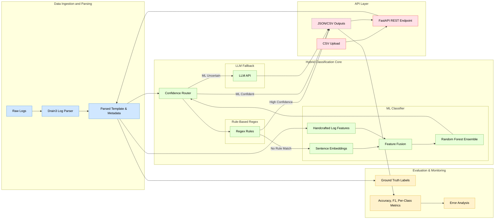

```mermaid
flowchart LR
    classDef ingest fill:#d0e7ff,stroke:#4a90e2,stroke-width:1px,color:#000
    classDef hybrid fill:#e8ffd8,stroke:#6ab04c,stroke-width:1px,color:#000
    classDef eval fill:#fff2cc,stroke:#e1b12c,stroke-width:1px,color:#000
    classDef api fill:#ffe0e6,stroke:#eb4d4b,stroke-width:1px,color:#000
    classDef connector stroke:#555,stroke-dasharray: 3 3

    subgraph Ingestion["Data Ingestion and Parsing"]
        A[Raw Logs]:::ingest
        B[Drain3 Log Parser]:::ingest
        C[Parsed Template & Metadata]:::ingest
    end

    subgraph HybridClassifier["Hybrid Classification Core"]
        subgraph Layer1["Rule-Based Regex"]
            D[Regex Rules]:::hybrid
        end

        subgraph Layer2["ML Classifier"]
            E[Sentence Embeddings]:::hybrid
            F[Handcrafted Log Features]:::hybrid
            X[Feature Fusion]:::hybrid
            Y[Random Forest Ensemble]:::hybrid
        end

        subgraph Layer3["LLM Fallback"]
            G[LLM API]:::hybrid
        end

        H[Confidence Router]:::hybrid
    end

    subgraph Eval["Evaluation & Monitoring"]
        I[Ground Truth Labels]:::eval
        J[Accuracy, F1, Per-Class Metrics]:::eval
        K[Error Analysis]:::eval
    end

    subgraph API["API Layer"]
        L[FastAPI REST Endpoint]:::api
        M[CSV Upload]:::api
        N[JSON/CSV Outputs]:::api
    end

    A --> B --> C --> H
    H --> D
    D -->|High Confidence| N:::connector
    D -->|No Rule Match| E
    C --> F
    E --> X
    F --> X
    X --> Y --> H
    H -->|ML Confident| N
    H -->|ML Uncertain| G --> N

    C --> I
    N --> J --> K

    M --> L --> C
    N --> L
```
